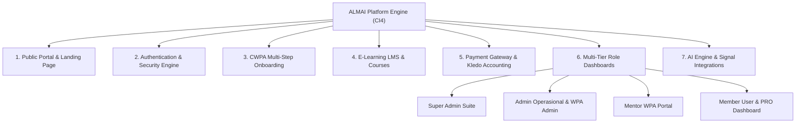

# ALMAI Platform - Design System & System Architecture (`design.md`)

Dokumen spesifikasi desain (*Design Specification*), sistem desain antarmuka (*UI/UX Design System*), arsitektur modular, dan alur kerja untuk **Platform ALMAI (PT. Alma Indonesia Raya)** yang berada pada folder `almai-new`.

---

## 1. Ikhtisar & Identitas Platform

**ALMAI (Almai E-Learning & Financial Technology Ecosystem)** adalah platform komprehensif berbasis **CodeIgniter 4** yang mengintegrasikan edukasi pasar modal, program sertifikasi profesi **Wakil Penasihat Berjangka (WPA)**, kandidat **CWPA (Certified WPA)**, ekosistem *AI Trade Engine*, sistem point & membership PRO, serta integrasi akuntansi dan gateway pembayaran modern.

### Peran Utama (*User Roles & Personas*):
1. **Super Admin**: Pengendali penuh sistem, analitik pendapatan, manajemen pengguna & hak akses, audit keuangan, dan integrasi API.
2. **Admin / Admin WPA**: Verifikasi berkas pendaftaran CWPA, manajemen kelas, presensi absensi, dan penerbitan sertifikat resmi.
3. **WPA (Mentor Resmi)**: Dashboard mentor, pengelolaan sesi bimbingan, jadwal webinar, serta pemantauan komisi & referral.
4. **CWPA (Kandidat Mentor)**: Alur *multi-step onboarding*, kurikulum pelatihan, pengumpulan tugas, dan evaluasi kelulusan.
5. **User / Member (Free & PRO)**: Akses materi kelas, portofolio transaksi, sistem poin reward, sertifikat kelulusan, dan asisten AI.

---

## 2. Sistem Desain UI/UX (*Design Tokens & Aesthetics*)

Platform `almai-new` menerapkan gaya visual **Cyber-Modern Dark Mode** dengan sentuhan **Glassmorphism**, aksen neon berenergi tinggi, dan struktur kartu modular (*dash-card*) yang terorganisir.

### A. Palet Warna (*Color Palette*)

```
Primary Background : #0A0C10 / #0B0F19 (Deep Obsidian Black)
Secondary Surface  : #111827 / #141414 (Slate Dark)
Card Surface       : #1A1A1A / rgba(26, 26, 26, 0.7) (Glassmorphism)
Border Color       : rgba(255, 255, 255, 0.08) / rgba(255, 255, 255, 0.12)
```

| Token Warna | Nilai Hex | Penggunaan Utama |
| :--- | :--- | :--- |
| `accent` | `#33E818` | Aksen identitas brand ALMAI (Electric Neon Green), tombol utama, indikator aktif |
| `blue` | `#3B82F6` | WPA Mentor resmi, link navigasi, informasi umum |
| `cyan` | `#06B6D4` | CWPA Kandidat, status progres, fitur teknologi |
| `purple` | `#8B5CF6` | Modul Admin, webinar akbar, strategi edukasi |
| `amber / gold`| `#F59E0B` | User PRO, Member Premium, sistem Poin ALMAI |
| `emerald` | `#10B981` | Transaksi berhasil (*Confirmed*), pertumbuhan pengguna, status lunas |
| `rose` | `#F43F5E` | Tagihan jatuh tempo, status gagal (*Rejected*), batas deadline |

### B. Tipografi (*Typography*)
- **Font Utama (Sans)**: `Montserrat`, `sans-serif` (dikonfigurasi pada `tailwind.config.js`).
- **Font Tambahan (Body & Form)**: `Plus Jakarta Sans`, `Inter`, `system-ui`.
- **Font Finansial & Kode**: `JetBrains Mono`, `Monospace` (untuk angka nominal transaksi Rp dan kode voucher/OTP).

### C. Komponen Kartu & Efek Visual (*Card & Micro-interactions*)
- `.dash-card`: Latar belakang gelap transparan dengan `backdrop-filter: blur(12px)`, radius `12px` hingga `16px`, dan border halus `1px solid rgba(255, 255, 255, 0.08)`.
- `.dash-card-interactive`: Efek *hover* mengangkat kartu `translateY(-2px)`, meningkatkan intensitas border aksen, dan membesarkan ikon sebesar `scale(1.1)`.
- `AOS (Animate On Scroll)`: Efek transisi masuk halaman yang mulus (*fade-up*, *zoom-in*).

---

## 3. Arsitektur Modul & Struktur Halaman



---

## 4. Rincian Subsistem Fungsional

### 1. Pendaftaran CWPA Multi-Step Flow (`/daftar-cwpa`)
- **Step 1 - Data Diri**: Nama lengkap, NIK, kontak WhatsApp, email, dan alamat domisili.
- **Step 2 - Dokumen Legal**: Upload KTP, NPWP, Ijazah Pendidikan, dan Pas Foto Formal.
- **Step 3 - Pilihan Paket & Mentor**: Pemilihan batch kelas sertifikasi dan penunjukan mentor pembimbing resmi.
- **Step 4 - Review & Pembayaran**: Integrasi checkout Xendit / transfer bank / poin potongan.

### 2. E-Learning & Course Management (`/kelas`, `/user/belajar`)
- Pemutar materi video terproteksi (mencegah download ilegal).
- Kurikulum bertingkat (*Syllabus tree*), lampiran materi (PDF/e-Book), kuis interaktif, dan pelacakan progres belajar per bab.
- Penerbitan **Sertifikat Digital Otomatis** (`DomPDF`) dengan verifikasi QR-Code unik.

### 3. Payment Gateway & Accounting Engine (`Checkout.php`, `Keuangan.php`)
- **Xendit Integration**: Mendukung Virtual Account (BCA, Mandiri, BNI, BRI), QRIS, E-Wallet (OVO, Dana, ShopeePay), dan Kartu Kredit.
- **Sistem Poin ALMAI**: Pembayaran parsial atau penuh menggunakan saldo poin hasil referral & reward aktivitas.
- **Kledo ERP Auto-Sync**: Sinkronisasi invoice, jurnal kas masuk, dan pencatatan akun bank penerima secara otomatis via Kledo API.
- **Komisi Mentor & Referral**: Perhitungan otomatis bagi hasil mentor WPA dan komisi afiliasi berjenjang.

### 4. AI Assistant & Market Signal (`ChatBot.php`, `TradingView.php`)
- **Groq & Gemini API Integration**: Chatbot interaktif edukasi finansial untuk menjawab pertanyaan member 24/7.
- **Trade Engine VPS Gateway**: Koneksi aman dengan server eksekusi algoritma di VPS (`https://aiwe.almai.id`).
- **TradingView Widget**: Chart interaktif realtime pasar keuangan global dan komoditas.

### 5. Multi-Channel Notification Hub
- **WhatsApp Gateway**: Integrasi Ivosights WABA & BalesOtomatis untuk pengiriman OTP login, bukti transaksi, dan reminder jadwal kelas.
- **Email SMTP**: Layanan SMTP2GO untuk faktur resmi dan pemulihan akun.
- **Web Push (VAPID)**: Notifikasi desktop & mobile langsung ke browser pengguna.
- **Telegram Bot**: Peringatan sistem real-time untuk tim operasional dan superadmin.

---

## 5. Struktur Direktori Proyek (`almai-new`)

```
almai-new/
├── app/
│   ├── Config/              # Konfigurasi Database, Routes, Email, Filters, Services
│   ├── Controllers/         # Controller aplikasi berdasarkan modul & peran
│   │   ├── Admin/           # Controller admin operasional
│   │   ├── Superadmin/      # Controller analitik & superadmin
│   │   ├── Wpa/             # Controller mentor WPA
│   │   ├── User/            # Controller member dashboard
│   │   ├── Cwpa/            # Controller kandidat CWPA
│   │   ├── Webhook/         # Webhook receiver (Xendit, Kledo, WABA)
│   │   ├── Auth.php         # Manajemen autentikasi & registrasi
│   │   ├── Checkout.php     # Engine checkout & payment
│   │   └── Keuangan.php     # Manajemen mutasi kas & komisi
│   ├── Models/              # Model data MySQL (UserModel, TransactionModel, etc.)
│   ├── Views/               # Template tampilan antarmuka
│   │   ├── superadmin/      # View dashboard & manajemen superadmin
│   │   ├── admin/           # View admin operasional
│   │   ├── wpa/             # View mentor WPA
│   │   ├── user/            # View member area & kelas
│   │   ├── cwpa/            # View proses sertifikasi CWPA
│   │   ├── pages/           # Landing page, tentang kami, kontak
│   │   └── layouts/         # Master template layout & partials
│   └── Database/            # Migrations & Database Seeders
├── public/                  # Asset publik (CSS, JS terkompilasi, Gambar, Uploads)
├── tailwind.config.js       # Konfigurasi TailwindCSS & token warna
└── .env                     # Konfigurasi environment & API keys
```

---

## 6. Standar Keamanan & Performa (*Security & Best Practices*)

1. **Proteksi Autentikasi**: Password dienkripsi menggunakan algoritma `BCRYPT`, didukung verifikasi 2-faktor (OTP WhatsApp/Email).
2. **Anti-Spam & Bot**: Proteksi form publik menggunakan **Cloudflare Turnstile**.
3. **Data Sanitization**: Proteksi terhadap CSRF (`csrf_field()`), XSS filtering, dan Prepared Statement PDO pada seluruh query database.
4. **Optimasi Asset**: Autoloading PSR-4 yang dioptimasi, caching view, serta penggunaan CDN untuk pustaka eksternal (FontAwesome, Chart.js).

---

*© 2026 PT. Alma Indonesia Raya (ALMAI) — All Rights Reserved.*
